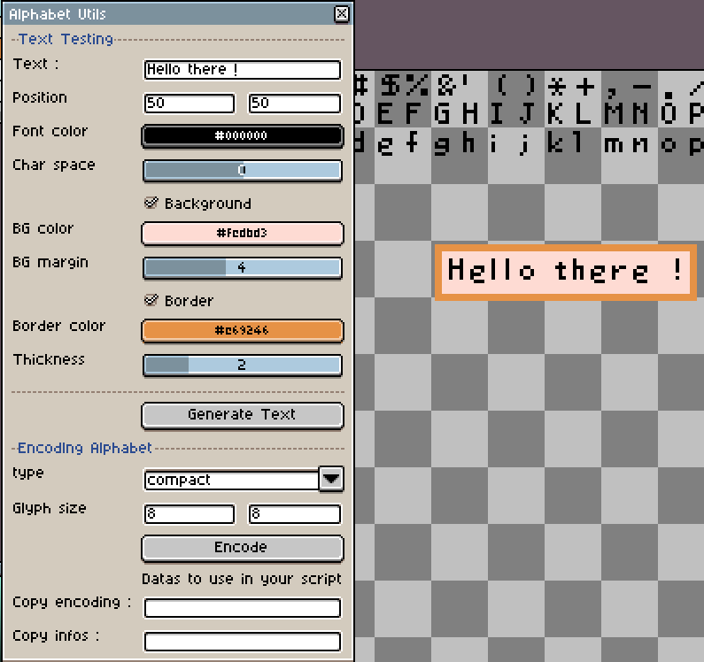

Aseprite Script Text Tool 0.6 (https://aseprite.org).  
Written by Augustin Clement a.k.a Bakadesign.  
(https://bakadesign.itch.io/) (https://github.com/Bakadesignz).  

# Aseprite Script Text Tool

Write text on a sprite using script and your own alphabet

## How to use?

1. Install the script in the Aseprite scripts folder
    - Launch it and try write some text 
2. Open the Alphabet.png test image provided
    - Parameters are set by default to work with this image
    - Click encode end see the alphabet's data entries being filled
3. For integration, look in the script the part to copy/paste in your own script
    - Copy everything between ### start ### and ### end ###
    - You have the Alphabet's data already there, then all the functions required
    - can now use the writeText() function to display text using script
4. Make your own Alphabet or any Glyph font if you wish
    - Compact encode is the method to use by default
    - Normal is just the original version, but a lot more cumbersome
    - Alpha is to use if your alphabet has some levels of transparency
    - Alpha preserve up to 8 levels of transparency and cannot be "compact"

## Notes

- It has been made to overcome some of the current limitations of the Aseprite API.
- It has its own limitations, for example, you have to encode a "new alphabet" for any different font or size.
- It would be technically possible to integrate several "alpahbet encoding" in the same script, but it would start to be cumbersome.
- the alphabet.png example is made from the asepprite font 7, with some modifications and some characters added.
- You can look in the script for more comments and infos.

